# Nivas — Society Maintenance Tracker

**A full-stack platform for apartment societies to manage maintenance complaints — from raise to resolve — with complete audit history, automated overdue detection, and real-time notifications.**


**Live App:** [nivas-janz.vercel.app](https://nivas-janz.vercel.app)
**Repository:** [github.com/JanaviPawar/nivas](https://github.com/JanaviPawar/nivas)
**System Design Write-up:** [SYSTEM_DESIGN.md](./SYSTEM_DESIGN.md)

---

## Table of Contents
- [Overview](#overview)
- [Screenshots](#screenshots)
- [Features](#features)
- [Architecture](#architecture)
- [Database Schema](#database-schema)
- [Tech Stack](#tech-stack)
- [Demo Credentials](#demo-credentials)
- [Setup Guide](#setup-guide)
- [API Reference](#api-reference)
- [Security](#security)
- [Known Limitations](#known-limitations-honest-trade-offs)

---

## Overview

Apartment societies typically manage maintenance complaints through scattered WhatsApp messages or paper registers — nobody can see what's pending, what's overdue, or which issues keep recurring. **Nivas** replaces that with a structured platform where:

- Residents raise complaints with photos and track their full history
- Admins triage, prioritize, and resolve complaints through a clear workflow
- Everyone stays informed via a pinned notice board and automatic emails
- Admins get real visibility through a reporting dashboard — not just a complaint list

---

## Screenshots

| Landing Page | Login |
|---|---|
| 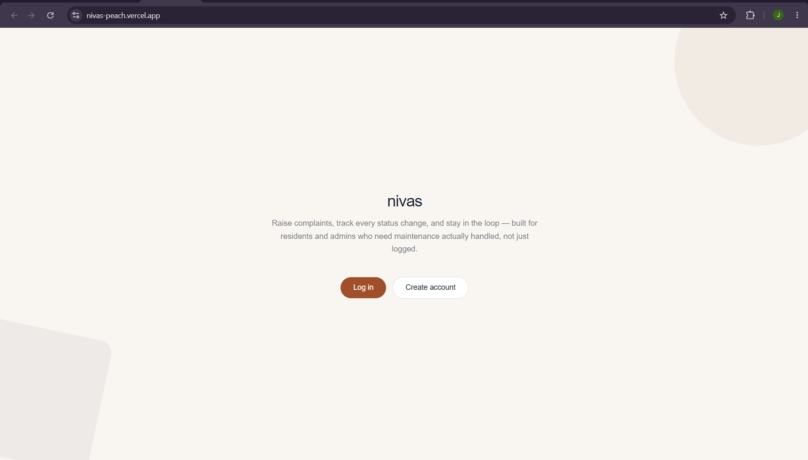 | 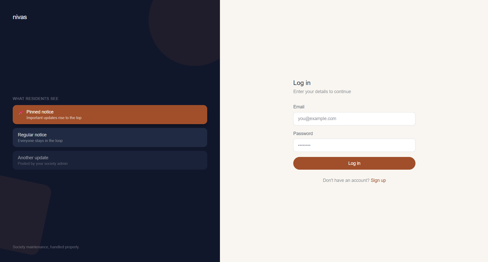 |

| Resident Dashboard | Admin Panel |
|---|---|
| 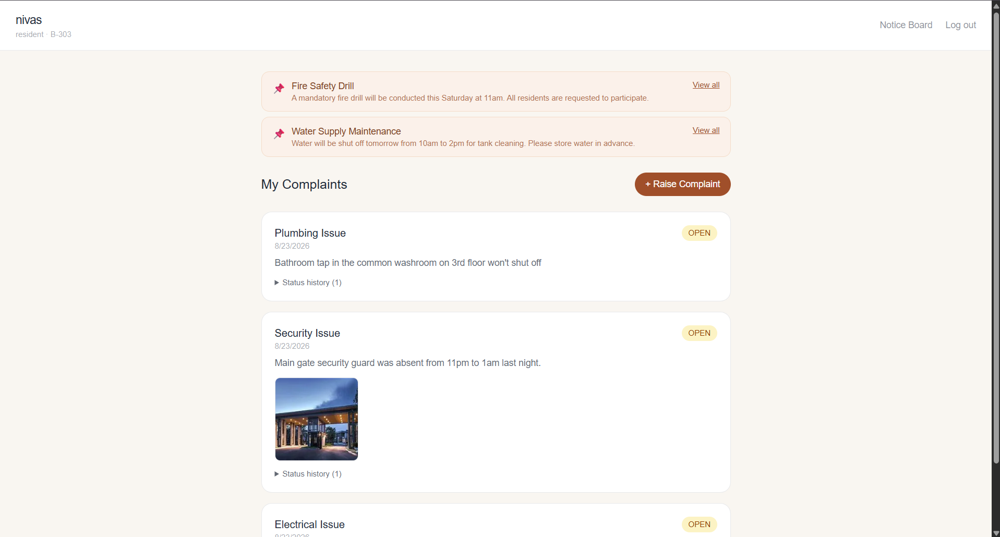 | 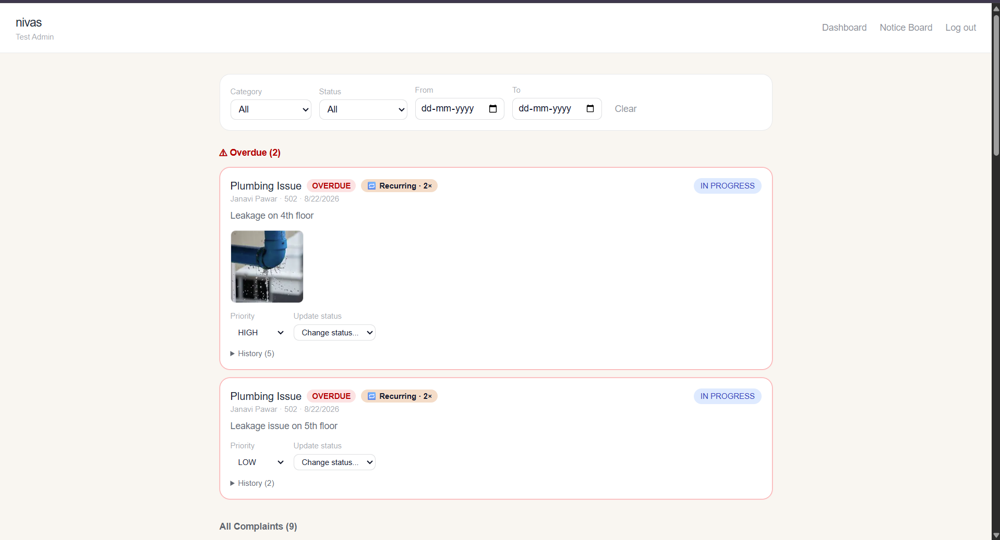 |

| Reporting Dashboard | Notice Board |
|---|---|
| 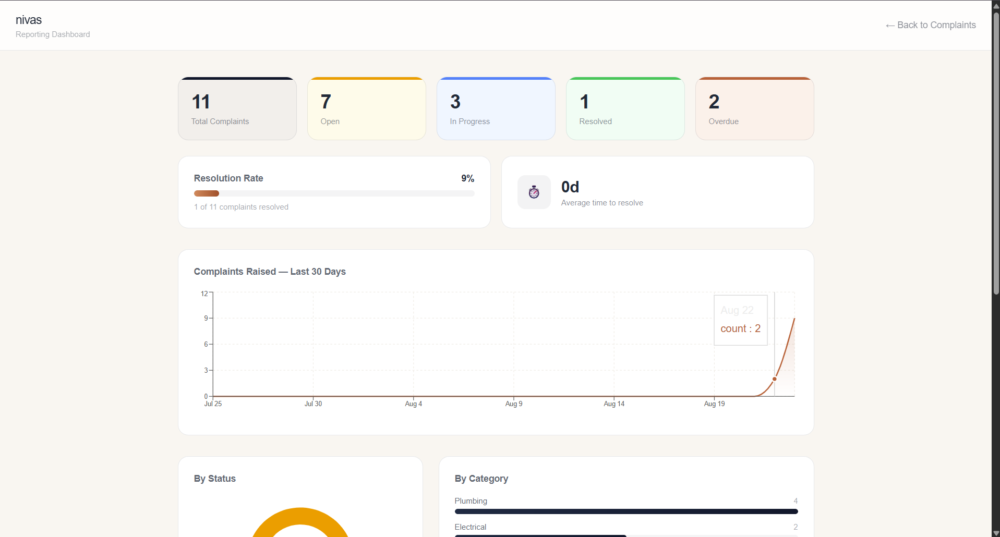 | 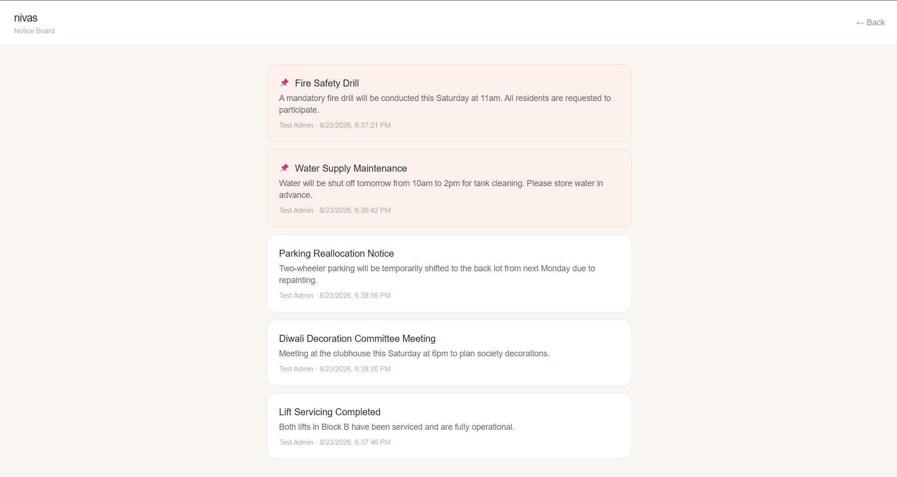 |

| Status Change Email | Important Notice Email |
|---|---|
| 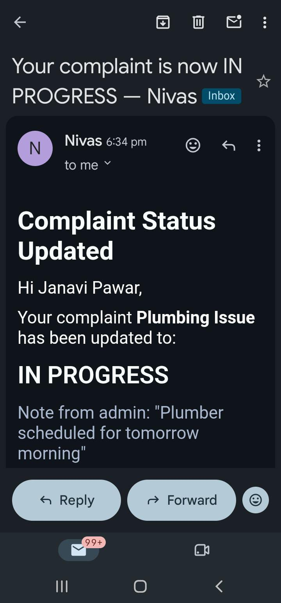 | 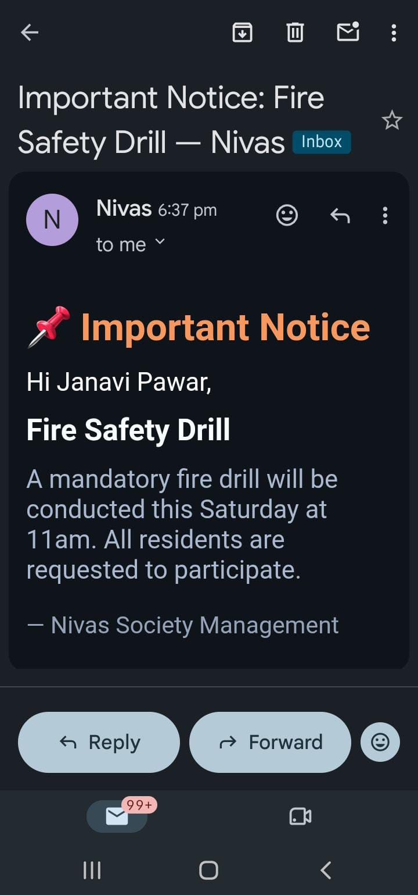 |

| Full Status History | Recurring Issue Detection |
|---|---|
| 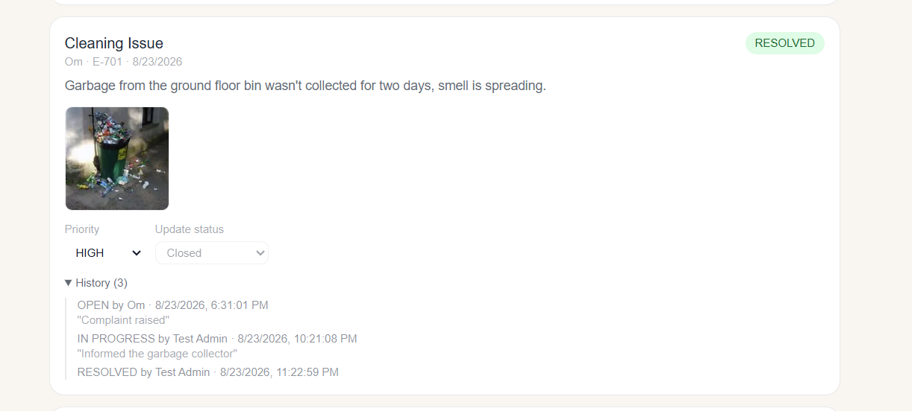 | 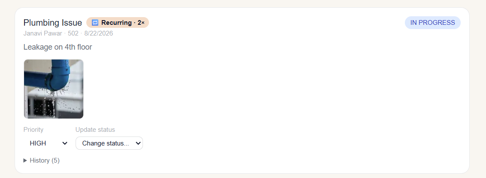 |
---

## Features

### Core (per assignment spec)
- Resident registration, login, and complaint raising with category, description, and optional photo
- Resident view of all complaints with full status history
- Admin view of all complaints with filters (category, status, date range)
- Priority management (Low / Medium / High)
- Status lifecycle (Open → In Progress → Resolved) with timestamped, attributed history and optional notes
- Automatic closure on Resolved
- Configurable overdue detection, surfaced at the top of the admin view
- Notice board with pinned "important" notices
- Email notifications on status change and important notices
- Admin dashboard: totals by status, by category, overdue count

### Beyond the spec
- **Recurring issue detection** — flags when the same flat raises 2+ complaints in the same category within 60 days, directly answering the brief's call-out that admins have "no way to see which issues keep coming back"
- **True multi-tenancy** — supports unlimited independent societies with complete server-side data isolation, not a single hardcoded society
- **Extended reporting** — resolution rate, average resolution time, 30-day complaint trend, priority breakdown, and longest-waiting open complaints
- **Gated admin signup** — prevents anonymous self-registration as admin, since admin accounts have society-wide control
- **Rate limiting** on login/register to slow brute-force and spam signups

---

## Architecture

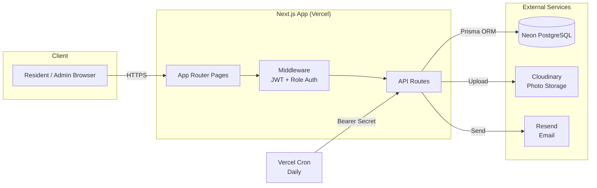

---

## Database Schema

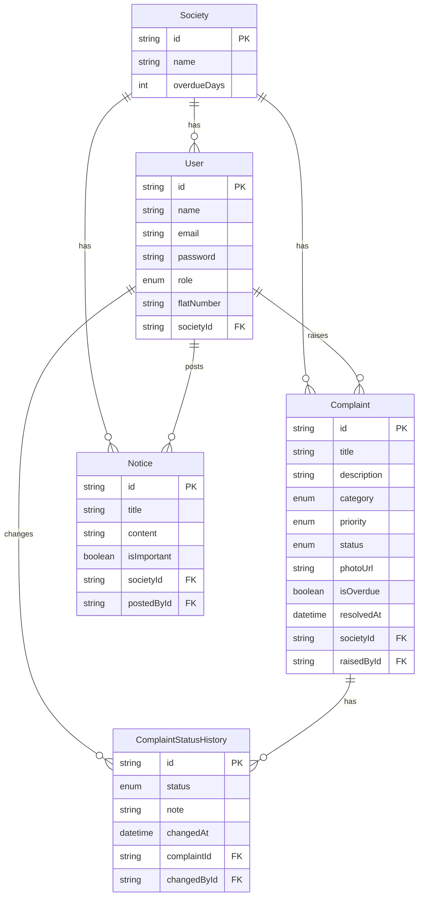

**Key design decision:** `ComplaintStatusHistory` is append-only — rows are never updated or deleted, only inserted. This is what gives every complaint a permanent, tamper-evident audit trail rather than a single overwritable status field. Full reasoning in [SYSTEM_DESIGN.md](./SYSTEM_DESIGN.md).

---

## Tech Stack

| Layer | Choice | Why |
|---|---|---|
| Framework | Next.js 16 (App Router, TypeScript) | Unified frontend + backend, fast to build and deploy |
| Database | PostgreSQL (Neon) | Relational integrity for a genuinely relational domain |
| ORM | Prisma | Type-safe queries, clean migrations, readable schema |
| Auth | JWT (httpOnly cookies) + bcrypt | Stateless sessions, XSS-resistant token storage |
| Photo storage | Cloudinary | Free tier, automatic optimization, no server disk dependency |
| Email | Resend | Simple API, reliable free tier |
| Charts | Recharts | Real chart rendering for the reporting dashboard |
| Styling | Tailwind CSS | Fast, consistent, no runtime CSS-in-JS overhead |
| Hosting | Vercel | Native Next.js support, built-in Cron |

---

## Demo Credentials

For quick evaluation without registering a new account:

**Admin**
- Email: `admin@test.com`
- Password: `test123`

**Resident**
- Email: `resident@nivas-demo.com`
- Password: `Demo@1234`

> Admin registration is gated by a shared secret code (`ADMIN_SIGNUP_CODE`) to prevent public self-registration as admin — access control is proportional to privilege: admin accounts have society-wide visibility and control, so signup is gated, while resident accounts are scoped only to their own complaints, so signup is left open. Use the demo admin account above rather than registering a new admin.

---

## Setup Guide

### Prerequisites
- Node.js 20+
- A free [Neon](https://neon.tech) PostgreSQL database
- A free [Cloudinary](https://cloudinary.com) account
- A free [Resend](https://resend.com) account

### 1. Clone and install
```bash
git clone https://github.com/YOUR-USERNAME/nivas.git
cd nivas
npm install
```

### 2. Configure environment variables
```bash
cp .env.example .env
```
Fill in your real values in `.env` — see [`.env.example`](./.env.example) for the full list.

### 3. Set up the database
```bash
npx prisma db push
npx prisma generate
```

### 4. Run locally
```bash
npm run dev
```
Visit `http://localhost:3000`.

### 5. Deployment
Deployed on Vercel with `vercel.json` scheduling the daily overdue-check cron job. All environment variables from `.env.example` must be added in the Vercel project settings.

---

## API Reference

All endpoints are Next.js API routes under `/api`. Authentication is via an httpOnly JWT cookie set on login/register.

### Auth
| Method | Endpoint | Description |
|---|---|---|
| POST | `/api/auth/register` | Create a resident or admin account. Admin requires `adminCode`. |
| POST | `/api/auth/login` | Log in, sets session cookie |
| POST | `/api/auth/logout` | Clears session cookie |
| GET | `/api/auth/me` | Returns the currently logged-in user |

### Societies
| Method | Endpoint | Description |
|---|---|---|
| GET | `/api/societies` | Public list of societies (for resident signup) |

### Complaints
| Method | Endpoint | Description |
|---|---|---|
| POST | `/api/complaints` | Resident: raise a complaint (multipart: category, description, optional photo) |
| GET | `/api/complaints` | Resident: own complaints. Admin: all complaints in their society, filterable via `?category=&status=&from=&to=` |
| PATCH | `/api/complaints/:id` | Admin: update priority and/or status with optional note. Triggers email on status change. |

### Notices
| Method | Endpoint | Description |
|---|---|---|
| GET | `/api/notices` | List notices (pinned first) |
| POST | `/api/notices` | Admin: post a notice. Emails all residents if marked important. |
| DELETE | `/api/notices/:id` | Admin: delete a notice |

### Dashboard
| Method | Endpoint | Description |
|---|---|---|
| GET | `/api/dashboard/stats` | Admin: aggregated stats — totals, by status/category/priority, resolution rate, avg. resolution time, 30-day trend, oldest open complaints |

### Internal
| Method | Endpoint | Description |
|---|---|---|
| GET | `/api/cron/check-overdue` | Daily scheduled job (Vercel Cron), protected by `CRON_SECRET` bearer token |

---

## Security

- Passwords hashed with bcrypt — never stored or returned in plaintext
- JWT stored in an httpOnly cookie — inaccessible to client-side JS, mitigating XSS-based session theft
- `sameSite: "lax"` cookie policy mitigates CSRF
- All queries parameterized via Prisma — no raw SQL, no injection surface
- Every admin action is scoped server-side to the admin's own `societyId` — cross-society access is impossible even with a guessed ID
- Rate limiting on login (10/min) and registration (5/min) per IP
- Cron endpoint requires a secret bearer token

---

## Known Limitations (Honest Trade-offs)

- **Resident signup is self-attested** — flat number and society are not independently verified. In production this would require admin-approval-gated accounts or a building-specific invite code; scoped out here to keep evaluation frictionless.
- **Neon free tier suspends when idle** — first request after inactivity may take a few seconds to wake the database.
- **Rate limiting is in-memory** — sufficient for this single-instance deployment; a multi-instance production system would need a shared store (e.g. Redis).
- **`ADMIN_SIGNUP_CODE` is a single shared secret** — appropriate for this scope; production would likely use invite-based admin onboarding.
- **Resend free tier** — without a verified domain, delivery is restricted to the Resend account owner's email. All server-side logic still executes correctly regardless (visible in Resend's dashboard logs).

---

Built as a submission project. See [SYSTEM_DESIGN.md](./SYSTEM_DESIGN.md) for the full design write-up.